#  Missão Prática | Nível 4 | Mundo 4
 
- Objetivos da prática

```
  - Demonstrar habilidade na criação e gerenciamento de recursos na 
  Nuvem Azure, adquirindo conhecimento sobre a estrutura básica da 
  plataforma Azure

  - Utilizar efetivamente o portal Azure para criar e configurar uma 
  Máquina Virtual (VM), demonstrando compreensão dos recursos e suas funções.

  - Configurar regras de rede e grupos de segurança, adquirindo conhecimento sobre a
estrutura das regras de rede na Nuvem Azure.
 
 - Importar um arquivo .bacpac para um banco de dados no Banco de Dados SQL do
Azure;

 - Criar e configurar um aplicativo web no Azure, demonstrando compreensão do
mecanismo de hospedagem e implantação de aplicativos web.
``` 

 - Especificação

https://sway.cloud.microsoft/s/Y32eUDswcOxAHalk/embed


# Microatividades  

## 1 - Criar uma Máquina Virtual (VM) no Azure

 Material necessário para a prática

   - Conta no Microsoft Azure.
   - Navegador Web (Google Chrome, Firefox, MS Edge, Safari ou Opera).

```
 obs: realizei a adesão ao plano estudantil oferecido a instituição   

```
### conta

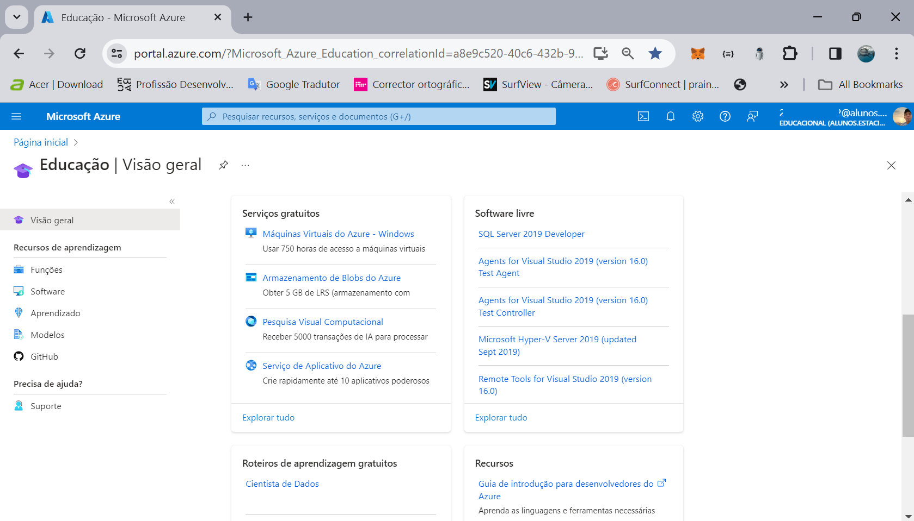

<BR>

### maquina virtual

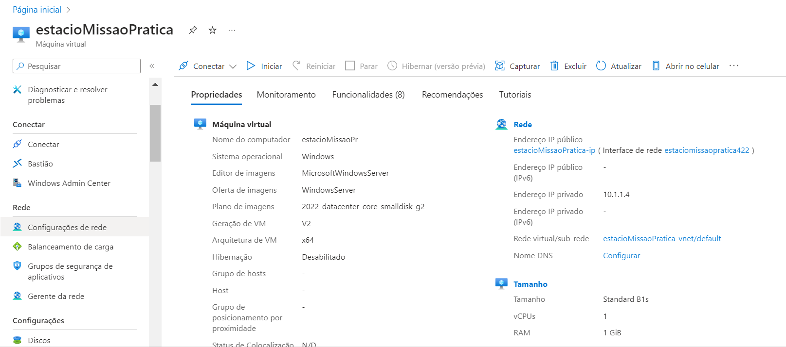

<BR>

## 2 - Configurar Regras de Rede e Grupos de Segurança no Azure

 - Crie uma regra para permitir que qualquer pessoa na internet possa acessar um
servidor Web hospedado na máquina virtual criada anteriormente. Preencha os campos
necessários para a regra, incluindo:

   - Origem: O filtro de origem pode ser qualquer (any), um intervalo de endereços IP,
Meu endereço IP, um grupo de segurança de aplicativo ou uma marca padrão. Ele
especifica o tráfego de entrada de um intervalo de endereços IP de origem específico
que será permitido ou negado por essa regra.

   - Intervalos de porta de origem: Forneça uma única porta, como, 80; um intervalo de
portas, como, 1024 a 65535, ou uma lista separada por vírgulas de portas e/ou
intervalos de portas únicos, como 80,1024-65535. Isso especifica de quais portas a
entrada de tráfego será permitida ou negada por esta regra. Forneça um asterisco (*)
para permitir o tráfego por meio de qualquer porta.

   - Destino: O filtro de destino pode ser Qualquer um, um intervalo de endereços IP, um
grupo de segurança de aplicativos ou uma marca padrão. Ele especifica o tráfego de
saída de um intervalo de endereços IP de destino específico que será permitido ou
negado por essa regra.


   - Serviço: O serviço especifica o protocolo de destino e o intervalo de porta para essa
regra. Você pode escolher um serviço predefinido, como RDP ou SSH, ou fornecer um
intervalo de porta personalizado. Se selecionar um serviço específico o próximo item
(Intervalos de porta de destino) será preenchido com o valor padrão e não será
editável.

   - Intervalos de porta de destino: Somente editável se na opção anterior for marcado
“Custom”. Forneça uma única porta, como, 80; um intervalo de portas, como, 1024 a
65535, ou uma lista separada por vírgulas de portas e/ou intervalos de portas únicos,
como 80,1024-65535. Isso especifica de quais portas a entrada de tráfego será
permitida ou negada por esta regra. Forneça um asterisco (*) para permitir o tráfego
por meio de qualquer porta.

   - Protocolo: Escolha entre as opções disponíveis (Any, TCP, UDP ou ICMP)
Ação: selecione entre permitir ou negar
Prioridade: ordem de processamento da regra. As regras são processadas em ordem
de prioridade; quanto menor for o número, maior a prioridade. Recomendamos deixar
lacunas entre as regras - 100, 200, 300, etc. - para que seja mais fácil adicionar
novas regras sem ter que editar regras existentes.
Nome da regra: Especifique um nome para a regra.
   
   - Descrição: Preencha uma descrição da regra especificando a sua finalidade

<BR>
   
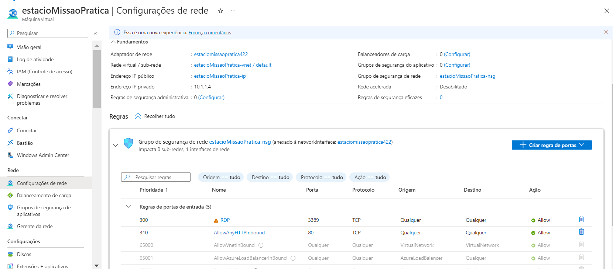

<BR>


## 3 - Criar um banco de dados SQL do Azure

 - O resultado esperado desta microatividade é que seja criado com
sucesso um Banco de Dados SQL na Microsoft Azure. Demonstrar de que o banco de
dados tenha sido criado com as configurações desejadas e que ele apareça na lista de
recursos no painel do Azure.

   - criação do banco
 
<BR>
   
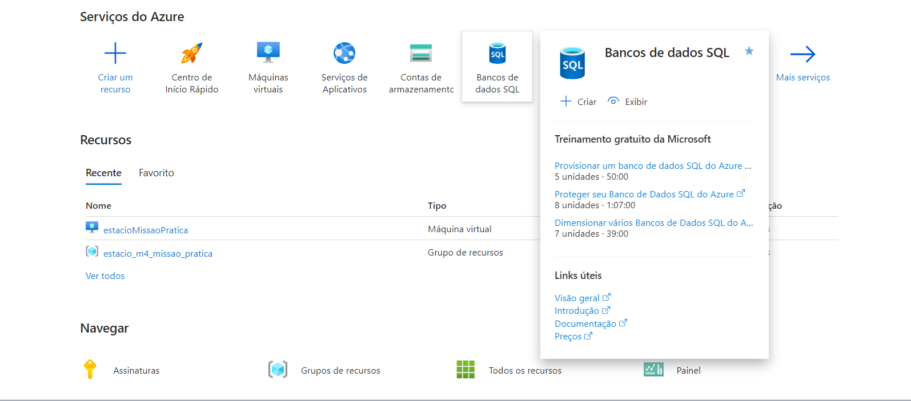

<BR>

   - conclusão do banco

<BR>
   
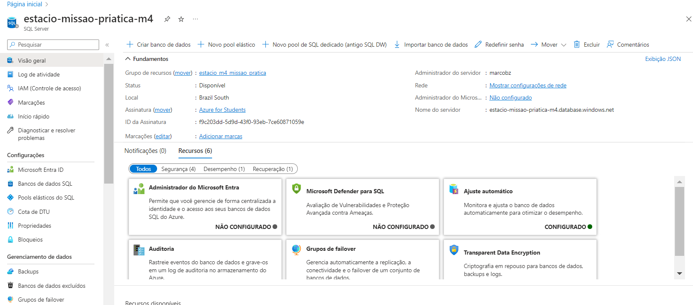

<BR>

 - obs: devido a um erro de digitação, o nome do banco ficou como 'fullstak' ao invés de 'fullstack'

## 4 - Conecta-se ao seu banco de dados

- Verificação do comando az sql db list para listar todos os bancos de dados no
servidor lógico do SQL do Azure. Você verá um grande bloco de JSON como saída.

<BR>
   
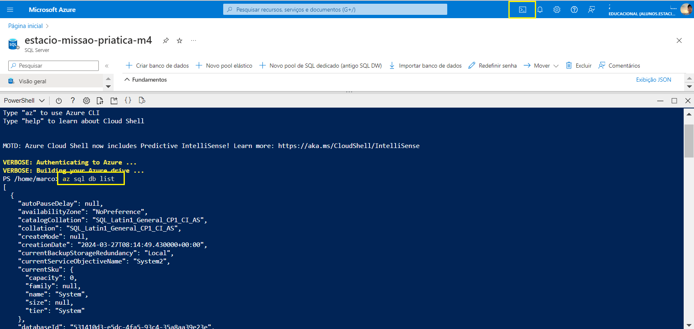

<BR>

- Agora a verificação do comando para visualizar apenas os nomes dos bancos de
dados. Desta vez, foi utilizada a ferramenta jq, um analisador JSON de linha de comando,
para extrair somente os campos de nome. Direcione a saída dos comandos az para o jq
usando o seguinte comando:

 

az sql db list | jq '[.[] | {name: .name}]'

 

- O resultado do comando apresentará atributos "name". Serão observados  dois atributos “name”. 
Um refere-se ao banco de dados criado nas atividades anteriores, denominado "fullstak", para este roteiro. 
No entanto, é importante observar que o banco de dados do sistema "master" também será listado, pois inclui os
metadados do servidor, como configurações de entrada e do sistema.


<BR>
   
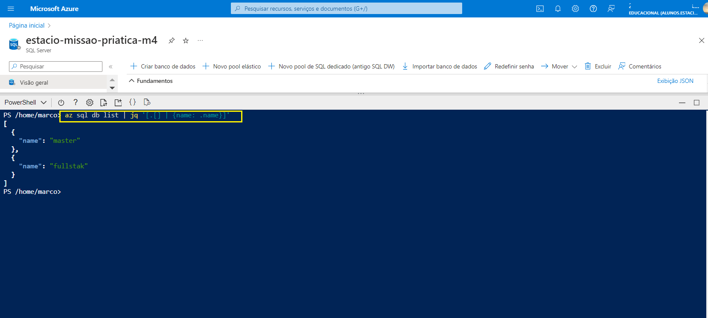

<BR>

Verificação do comando az sql db show usado para obter detalhes específicos sobre o
banco de dados. Substitua [nome-do-banco] pelo nome que você obteve no comando
anterior.

az sql db show --name fullstak
 

O resultado será uma extensa saída JSON. Para extrair informações relevantes, utilize a
ferramenta jq novamente.


<BR>
   
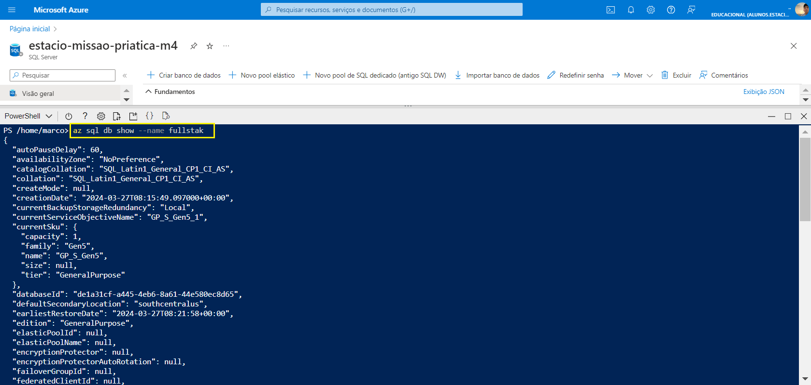

<BR>


 -  Desta vez, foi redirecionada a saída para o jq, filtrando
apenas o nome, tamanho máximo e status do banco de dados previamente criado. Isso
permitirá uma visualização específica, confirmando que o banco de dados está online e
revelando o volume máximo de armazenamento disponível.
 

az sql db show --name fullstak | jq '{name: .name, maxSizeBytes: .maxSizeBytes,
status: .status}'

<BR>
   
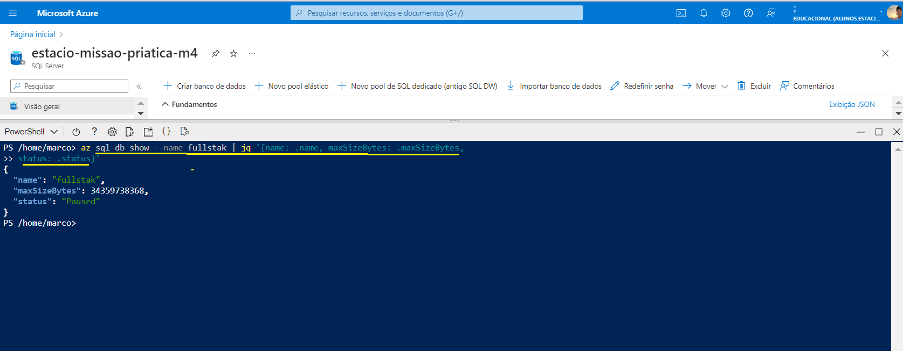

<BR>

- Agora é o momento de estabelecer uma conexão utilizando a ferramenta sqlcmd. Execute o
comando abaixo para obter a cadeia de conexão do banco de dados que está sendo
utilizado em um formato adequado para o sqlcmd:

az sql db show-connection-string --client sqlcmd --name fullstak

<BR>
   
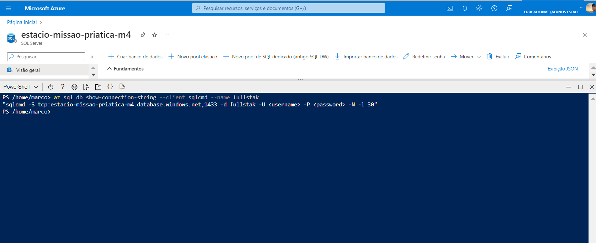

<BR>

IMPORTANTE: poderá aparecer uma mensagem de erro semelhante ao exemplo a
seguir:

 

Sqlcmd: Error: Microsoft ODBC Driver 17 for SQL Server:

Cannot open server 'contoso' requested by the login.

Client with IP address 'nnn.nnn.nnn.nnn' is not allowed to access the server.

To enable access, use the Windows Azure Management Portal or run
sp_set_firewall_rule

on the master database to create a firewall rule for this IP address or address range.

It may take up to five minutes for this change to take effect.

Se ocorrer esse erro, será necessário adicionar uma nova regra de firewall ao cliente.
Para fazer isso, siga as etapas abaixo:

 

Na página inicial do Azure, vá para "Serviços do Azure" e selecione "Todos os
recursos". Isso abrirá o painel de todos os recursos.
Localize o seu banco de dados e selecione-o. Isso abrirá o painel do banco de dados
SQL que você criou, neste roteiro, o banco chamado fullstack.
No menu superior, escolha "Definir o firewall do servidor". Isso abrirá o painel de
Rede.
Na seção "Regras de firewall", escolha "Adicionar uma regra de firewall". Isso abrirá
o painel para adicionar uma nova regra de firewall.
Insira um "Nome de regra" exclusivo e, em seguida, insira o endereço IP da
mensagem de erro nos campos "IP inicial" e "IP final".
Caso o acesso ao banco seja realizado através de endereços IP alocados para
qualquer serviço ou ativo do Azure, marcar o campo “Exceções: Permitir que serviços
e recursos do Azure acessem este servidor”
Clique em "OK".
Clique em "Salvar".
Execute novamente o comando.


<BR>
   
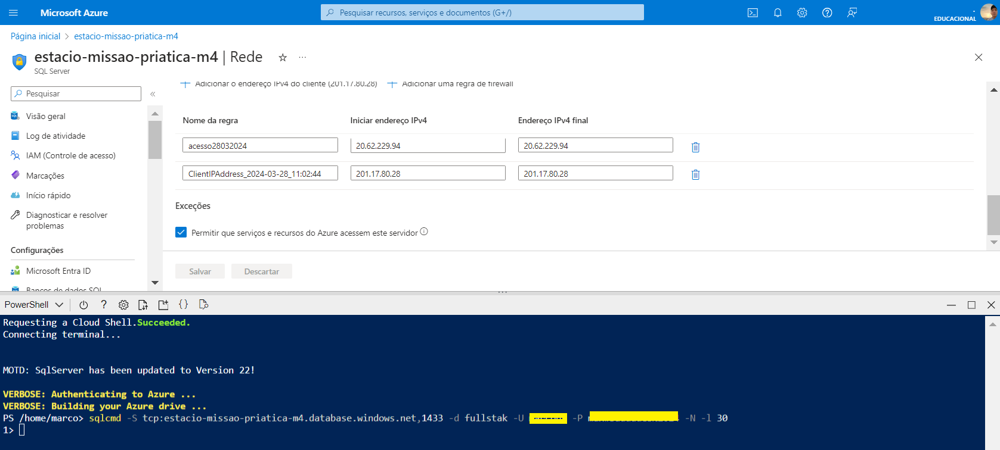

<BR>


## 5 - CRUD em um Banco de Dados

Neste ponto da prática, foi solicitada a criação, conexão e
manipulação de um banco de dados SQL no ambiente Azure. Utilizando instruções T-
SQL, abordaremos desde a criação de tabelas até operações CRUD (Create, Read,
Update, Delete).

 
A atividade inclui a criação de uma tabela denominada "Drivers" com atributos
específicos. Posteriormente, verificaremos a existência da tabela, inseriremos dados de
exemplo, realizaremos consultas para leitura, efetuaremos atualizações e exclusões,
concluindo com a verificação da tabela vazia.

obs: no meu caso, optei por usar o management sql server realizando uma coneção a
minha conta na azure

<BR>
   
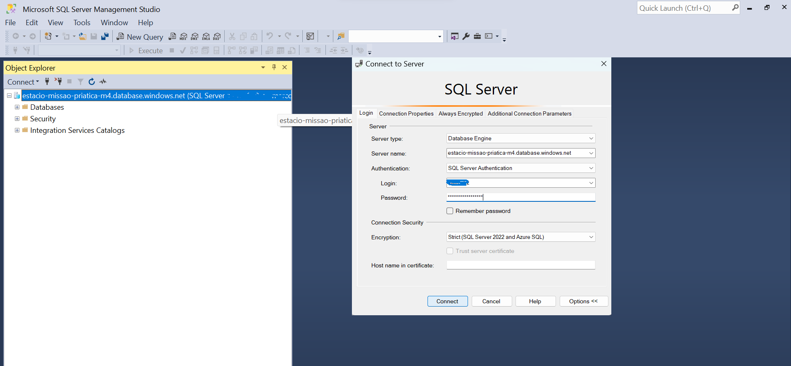

<BR>

- Operação de criação de tabela: Na sessão do management, executando a instrução
T-SQL para criar uma tabela chamada Drivers. A tabela é composta por quatro
colunas: um identificador exclusivo, sobrenome, nome do motorista e cidade de
origem do motorista.

CREATE TABLE Drivers (DriverID int, LastName varchar(255), FirstName varchar(255),
OriginCity varchar(255));

GO

<BR>
   
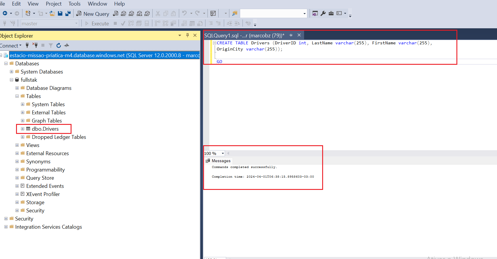

<BR>

- Verificação da Existência da Tabela Drivers: 2.    Execute as seguintes instruções T-
SQL para verificar se a tabela Drivers existe. Você deverá obter uma saída conforme a
imagem a seguir.

SELECT name FROM sys.tables;

GO

<BR>
   
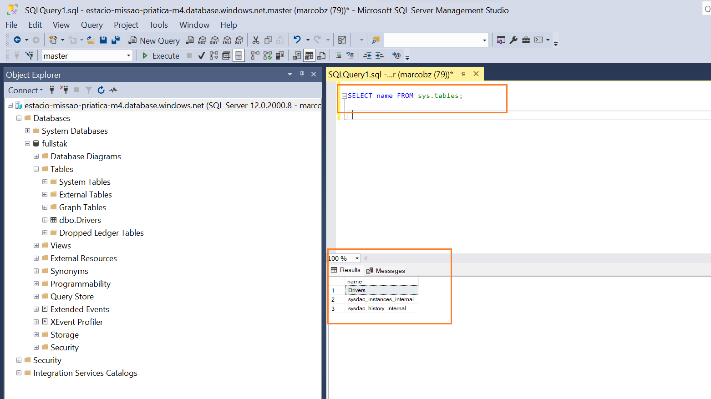

<BR>

- Operação de inserção: Para testar a operação de criação de registros no banco de
dados, execute as instruções T-SQL a seguir para adicionar uma linha de exemplo à
tabela.

INSERT INTO Drivers (DriverID, LastName, FirstName, OriginCity) VALUES (754, 'Silva',
'João', 'Rio de Janeiro');

GO

